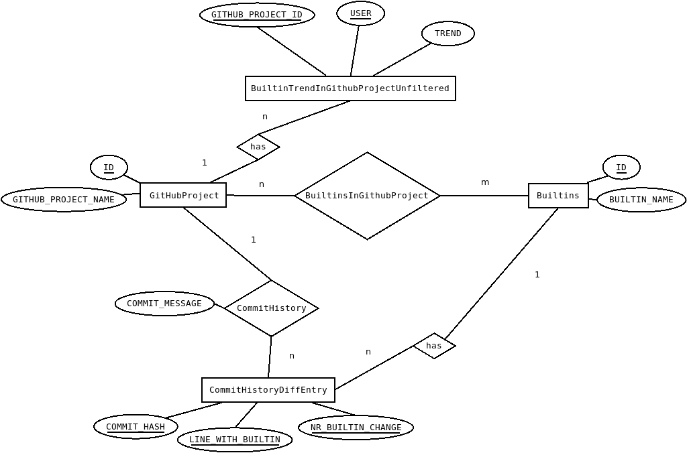

# Overview

This artifact is associated with the paper "Understanding GCC Builtins to Develop Better Tools" and provides the builtin raw data, the preprocessed data, and aggregated data of builtin usages. It also contains a record of the manual decisions made as part of this study. Furthermore, it contains all the scripts and applications to reproduce the paper's results.

# Requirements

To make full use of the artifact, we recommend using an Ubuntu 19.04 system (which is assumed for the further instructions). If you are not using Ubuntu, you can download a Virtual Box image from [osboxes.org](https://www.osboxes.org/ubuntu/):

The artifact requires the following dependencies:
* [git](https://git-scm.com/): for downloading the projects from GitHub
* [cloc](https://github.com/AlDanial/cloc): for retrieving metadata about the projects
* [Python 3](https://www.python.org/): for executing the Python scripts
* [sqlite3](https://www.sqlite.org/index.html): for opening the database
* Latex: to build the paper
* libcurl4-openssl-dev and libxml2-dev: required by the forecast R package (see [here](https://stackoverflow.com/questions/41940778/forecast-library-cant-be-installed))
* The R packages ggplot2, ggthemes, reshape, and forecast: for plotting
* A recent JDK and Eclipse: to use the Java projects

You can download these dependencies on Ubuntu as follows:

```
sudo apt install git cloc r-base-core python3 libcurl4-openssl-dev libxml2-dev sqlite3 texlive-full openjdk-11-jdk
echo 'install.packages(c("ggplot2", "ggthemes", "reshape", "forecast"), repos = "http://cran.us.r-project.org")' | sudo R --vanilla
```

We believe that the artifact works also on other Linux systems. Furthermore, browsing the SQLite3 database should be possible on any operating system that has SQLite3 installed.

# Database

The artifact provides the raw data, preprocessed data, and aggregated data of builtin usages. Furthermore, it also records the manual decisions made in parts of the study. Please unpack the database file contained in the `database.zip` archive.

The database is stored in the [./database.db](./database.db) file. It is stored as a SQLite3 database, so that it can be easily distributed and shared. For convenience, we suggest to explore the database's content using [sqlitebrowser](https://sqlitebrowser.org/dl/), which is a GUI for SQLite3 databases and can be used on both Linux, Windows, and MacOS. Alternatively, the database can also be accessed on the command line by installing [SQLite3](https://www.sqlite.org/index.html) and typing `sqlite3 database.db`. The figure below shows an ER diagram created using [Dia](http://dia-installer.de/shapes/ER/index.html.en) with the most important entities and relations represented in the database.



Tables with a suffix `Unfiltered` indicate raw data that is filtered by a view. For example, the database contains a table `GithubProjectUnfiltered` that contains the ~5,000 projects that we initially considered in our study. As described in the paper, we excluded projects having less than 100 LOC as well as GCC and forks of GCC. Rather than removing this projects from the database, we inserted a view `GithubProjectView` that filters the project: `CREATE VIEW GithubProjectView as SELECT *, CLOC_LOC_C+CLOC_LOC_H AS CLOC FROM GithubProjectUnfiltered WHERE PROCESSED=1 AND CLOC >= 100 AND GITHUB_PROJECT_NAME NOT IN ("gcc", "gcc-xtensa", "gccxml", "rose")` (note that `PROCESSED=1` ensures that only those projects are considered that were fully processed by the `BuiltinAnalyzer`). Filtering the data rather than removing it allows to reproduce every filtering step. However, having many nested views results in slow queries - querying some of the view takes several minutes. To this end, we implemented a script to persist views in a table (see [./src/includes/sync_views_to_tables.py](./src/includes/sync_views_to_tables.py)). Thus, the database also contains a table `GithubProject` with the content of the `GithubProjectView` view. Thus, if you make changes to the content of the database, make sure to execute [./src/includes/sync_views_to_tables.py](./src/includes/sync_views_to_tables.py) to synchronize the views and tables. The sqlitebrowser allows, for example, to easily determine the `CREATE` statements for the views (see below).


# Paper

Most numbers mentioned in the paper are generated directly from the data contained in the database, rather than being hardcoded, to make the results better reproducible and prevent that outdated data is included.

We recommend having a look at the [./generated/latex/generated.tex](./generated/latex/generated.tex) file that contains many of the commands and tables included in the paper. The [./paper/Makefile](./paper/Makefile) generates this data. Type `make` in the [./paper](./paper) to generate it (if missing).


# Source Code

The source code is contained in the [./src](./src) directory. Java programs are contained in the [./src/JavaProject](./src/JavaProject) directory and include multi-threaded programs to analyze the builtin usage, as well as GUIs for browsing the builtin usage of the projects and classifying their trends (see below).


The Python scripts in [./src](./src) were used for various purposes, for example, for fetching the GitHub projects and aggregating data from the database.

The [./src/plots](./src/plots) directory contains R scripts to plot the figures contained in the paper.


# Paper sections reflected in the artifact

## Methodology

### Selecting the projects

* For the script that fetches the projects, see the [./src/fetch_github_projects.py](./src/fetch_github_projects.py) script.
* For the coverage score, see the [./coverage](./coverage) directory.
* For how we filtered projects, see the definition of the `GithubProjectView` in [./database.db](./database.db).
* For how we identified builtins from the documentation, see [./defs](./defs).
* For how we identified builtins from the GCC source code, and how we identified builtin usages in the ~5,000 projects, see [./BuiltinAnalyzer](./BuiltinAnalyzer).
* For how we excluded builtins, see [./src/sync-excludes.py](./src/sync-excludes.py).
* For how we extracted builtin usages, see [./src/README.md](./src/README.md).

## Section 3.1 RQ1: How frequently are builtins used?

* See [./src/stat.py](./src/stat.py) for how the stats are generated.

## Section 3.2 RQ2: For what purposes are builtins used?

* See [./src/stat.py](./src/stat.py) for how the stats are generated.

## Section 3.3 RQ3: How many builtins must be implemented to support most projects?

See [./src/implementation_effort.py](./src/implementation_effort.py).

## Section 3.4 RQ4: How does builtin usage develop over time?

* See [./src/JavaProject/README.md](./src/JavaProject/README.md).

## Section 3.5 RQ5: How well do tools support builtins?

* The scripts and data related to this research question are described in [./gcc-builtin-tests/README.md](./gcc-builtin-tests/README.md).

# Limitations of this artifact

We performed the study on over 5,000 GitHub projects, which occupy several hundreds of GB and for which extracting the builtins and commit history requires multiple days. Thus, we did not include the GitHub projects itself into the artifact (they would otherwise be located in the [./projects](./projects) directory).

However, since we considered only popular GitHub projects, we assume that most projects are still available on GitHub.
Furthermore, the `GithubProjectUnfiltered` table, which contains meta data about the projects contains a column `PULL_HASH` referencing the projects' last commit when we performed the analysis.


# Directory structure including all Markdown files

```
├── LICENSE.md
├── README.md
├── STATUS.md
├── __pycache__
├── coverage
│   ├── README.md
│   └── sampling_software_projects
├── defs
│   ├── README.md
│   └── architecture-specific
│       └── internal
├── excludes
├── gcc-builtin-tests
│   ├── README.md
│   └── tests
│       ├── LICENSE.md
│       ├── README.md
│       └── test-cases
├── generated
│   ├── historical-data
│   │   ├── csv
│   │   └── plots
│   │       ├── pdf
│   │       └── png
│   ├── latex
│   └── plots
├── paper
├── projects
└── src
    ├── FETCH_GITHUB_PROJECTS.md
    ├── JavaProject
    │   ├── JAVA_PROJECTS.md
    │   ├── bin
    │   ├── lib
    │   └── src
    ├── __pycache__
    ├── helper-gcc-doc-extraction
    │   └── README.md
    ├── include
    │   └── __pycache__
    ├── plots
    │   └── README.md
    └── screenshots
```
