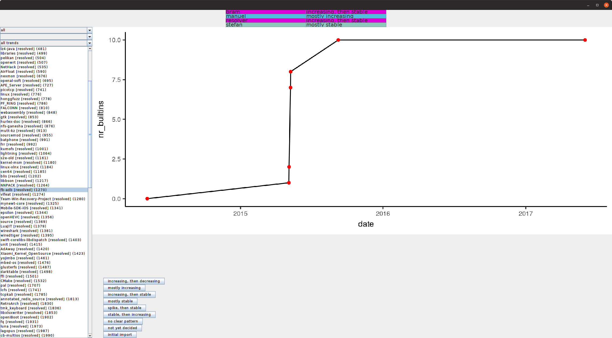

# Analysis of builtin usages and Graphical User Interfaces

The `$ARTIFACT_ROOT/src/JavaProject` folder contains an Eclipse project and various Java programs used in this study. Java was used to analyze the builtin usages since it has a better multi-threading performance than Python, which uses a Global Interpreter Lock (GIL), and thus allows only the execution of a single thread at any given point in time. Java was also used to develop the Graphical User Interfaces used to explore builtin usage, for classifying builtin trends, and determining a consensus on the classified builtins.

To import the Java projects do the folowing:
* Download Eclipse from https://www.eclipse.org/downloads/.
* Open Eclipse and select `$ARTIFACT_ROOT/src/` as the workspace.
* Click `File`, select `Import`, select `General`, select `Existing Projects into Workspace` and click `Next`.
* At `Select root directory`, select `$ARTIFACT_ROOT/src/JavaProject` and click `Finish` to import the project.
* To run a program, select the Java file (e.g., `ConsensusFindingGui`, right click on it, select `Run as`, and `Java application`.

## BuiltinAnalyzer

The `BuiltinAnalyzer.java` class was used to (1) extract the builtin names from GCC, and (2) extract the builtin usages from the ~5,000 GitHub projects.

To extract the builtin names, the program relies on the [GCC mirror](https://github.com/gcc-mirror/gcc) having been cloned and residing in the `$ARTIFACT_ROOT/projects` folder. It then inserts the found builtins into the `BuiltinsUnfiltered` table.

To extract builtin usages, the program uses the same regex to identify builtin usages and inserts found usages (along with some metadata) into the `BuiltinsInGithubProjectUnfiltered` table.

Note that the analyzer runs multiple days to process all projects.

## HistoryAnalyzer

The `HistoryAnalyzer.java` class analyzes the projects' individual commits in how they added, removed, or changed builtins. Commits that changed the use of builtins are inserted into the table `CommitHistoryUnfiltered`, while lines within a commit are inserted into `CommitHistoryDiffEntryUnfiltered`.

Note that the analyzer runs multiple days to process all projects.

## HistoryBrowser

The `HistoryBrowser.java` class was used to explore how individual projects added and removed builtins, in particular, to answer RQ4.

The following screenshot shows how the GUI is expected to look:

The top plot shows how builtins are added or removed over time. Each red dot indicates a commit that changes the number of builtins used by the project. Additionally, a red dot is inserted for the first commit and the last one. Below the plot, buttons allow the user to classify the builtin trend of the project (classifications are inserted into the `BuiltinTrendInGithubProjectUnfiltered` table). On the very bottom, each commit that changes the use of commits is displayed (i.e., it is different to the plot which only shows commits that changed the number of builtins). When selecting a commit, the right side shows the corresponding commit message and the lines for which builtins where removed, changed, or added. The left side shows the projects, and provides options for filtering.

## ConsensusFindingGUI

After individual classification of the builtin trends, we discussed the invidual project trends to come to a consensus on the classification. To this end, we used the `ConsensusFindingGUI` program.

The following screenshot shows how the GUI is expected to look:

The top part shows the researcher's invidiual classifications. The bottom part shows the buttons with the builtin trends. When pressing one of the buttons, which indicates a consensus decision, the decision is inserted into the `BuiltinTrendInGithubProjectUnfiltered` table assuming the user `resolver`. The left part allows selecting and filtering projects.
